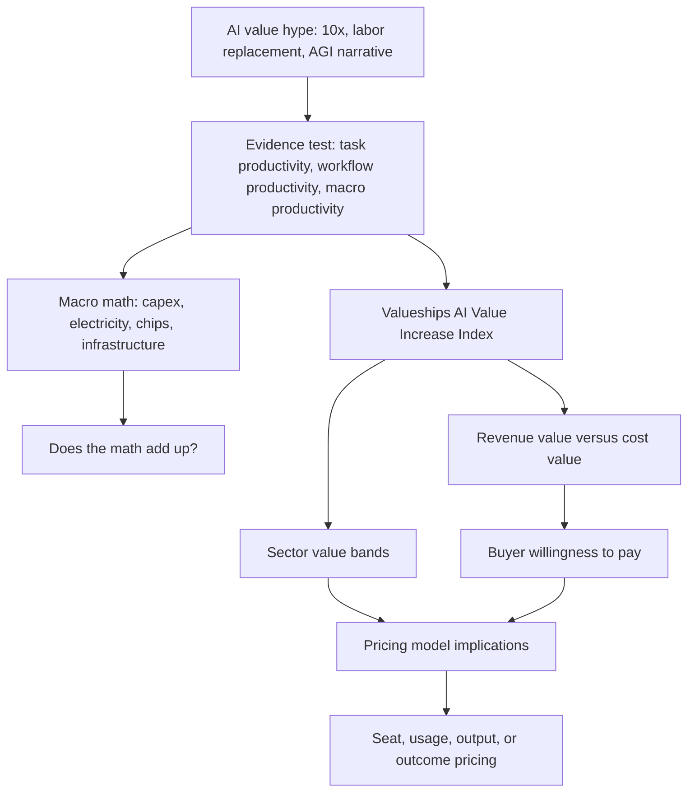

# Demystifying the Value of AI

Master content map for the Valueships AI value, productivity, and pricing research program.

## How to use this master file

This file is the central map of content for the AI value report. It is designed to work like an Obsidian hub: every major claim, evidence cluster, framework, chart, and future deep-dive should connect back to one of the nodes below. The working title for the full report should be: **Demystifying the Value of AI: How Much Real Economic Value Is Actually in AI, and Can You Price It?**

The organizing thesis is not that AI has no value. The thesis is that current LLM-era AI is usually a bounded productivity multiplier rather than an 80% headcount-reduction machine. The strongest observed effects tend to concentrate in task-level workflows, while enterprise-level and macroeconomic value depends on adoption, integration, review cost, reliability, risk, and whether value shows up as revenue expansion or cost reduction.

## The current evidence base

The current workspace contains five Markdown research files, one chart-ready Excel evidence pack, and seven generated chart images. The Excel evidence pack contains 17 sheets: README, 10 original evidence and calculator sheets, a Source Register, and 5 added sheets covering the Valueships index method, sector index, revenue-cost mix, pricing model matrix, and booster claims.

The filtered Markdown corpus currently contains 72 research URLs after excluding workbook-internal XML schema links. This count should be treated as a working methodological count, not a final bibliographic count, because the Excel Source Register and Statista-style benchmark sheet should be reconciled into one final APA reference table before PDF production.

Core local artifacts to connect:

| Artifact node | File | Role in the report graph |
|---|---|---|
| Main dossier | `real-quantified-value-of-ai-today.pplx.md` | Narrative report and current synthesis of macro, task, sector, pricing, and index findings |
| Evidence pack | `ai-productivity-pricing-evidence-pack.xlsx` | Statista-style workbook with one chart or insight per sheet |
| Productivity evidence | `ai_productivity_evidence_final.md` | Task-level and workflow-level empirical evidence |
| Macro and labor evidence | `ai_macro_labor_evidence.md` | TFP, labor exposure, adoption, and macro scenario context |
| Pricing implications | `ai_pricing_implications_research.md` | AI monetization, outcome pricing, SaaS pricing transition, and quote bank |
| Raw productivity research | `ai_productivity_evidence_research.md` | Supporting source extraction and research notes |

## The graph of the argument

The graph should preserve a critical distinction: exposure is not value, adoption is not value, task speed is not value, and gross productivity is not priceable value. Value becomes priceable only after it survives the enterprise conversion chain: task effect, workflow integration, human review, reliability, risk, attribution, and buyer budget logic.

## Core report structure

### Foreword: why this report exists

The foreword should open with the user’s LinkedIn hypothesis: LLMs are potentially revolutionary as tools, but the current evidence looks more like a 20-40% workflow multiplier than a 10x productivity revolution or an 80% workforce-reduction engine. It should explicitly frame the report as an attempt to create one common denominator from hundreds of fragmented claims about AI value.

The strongest version of the foreword is:

> Every week another report says AI creates value. The problem is that every report measures value differently: hours saved, tickets resolved, code shipped, documentation time reduced, revenue generated, errors avoided, or GDP lifted. This report asks a simpler question: after normalizing those claims into one economic denominator, how much real value is actually there?

The foreword should also explain why value selling needs this report. If most AI benefits are cost savings rather than revenue gains, and if value-based pricing literature generally finds revenue-side arguments more persuasive than cost-side arguments, then AI vendors face a monetization problem even when the product genuinely improves productivity.

### Methodology: the evidence funnel

The methodological note should present the research as a structured meta-analysis of industry reports, scientific papers, macroeconomic forecasts, public pricing cases, and benchmark datasets. The current evidence base has 5 Markdown research files, 17 workbook sheets, and 72 filtered research URLs in the Markdown corpus before final reference reconciliation.

Evidence should be scored on five dimensions:

| Evidence dimension | Question | Scoring logic |
|---|---|---|
| Causal strength | Was the effect causally estimated or merely observed? | Randomized controlled trial and field experiment score higher than surveys or vendor claims |
| External validity | Does the setting generalize beyond the study context? | Enterprise deployments score higher than narrow lab tasks |
| Measurement object | What exactly improved? | Revenue and attributable cost score higher than generic sentiment or adoption |
| Review and risk drag | How much human checking remains? | Lower verification burden increases net value |
| Pricing salience | Can a buyer and vendor agree on the value metric? | Clear units such as resolved tickets score higher than diffuse knowledge-worker time |

The report should state that normalization is necessary because source metrics are heterogeneous. A 30% reduction in legal review time, a 14% improvement in customer-support productivity, a 55% faster coding task, and a 1.5 percentage-point TFP forecast do not mean the same thing. The index exists to convert these into comparable economic value.

### Chapter: the booster narrative

This chapter should present the strongest “AI is bigger than expected” case before challenging it. It should quote executives and reports ruthlessly, not as strawmen, but as the highest-confidence version of the opposing thesis.

Quote boxes to include:

> “You’re not going to lose your job to an AI, but you’re going to lose your job to someone who uses AI.” Jensen Huang used this formulation to argue that AI capability changes the competitive standard for workers rather than simply replacing everyone at once ([CNBC](https://www.cnbc.com/2025/05/28/nvidia-ceo-jensen-huang-youll-lose-your-job-to-somebody-who-uses-ai.html)).

> Dario Amodei warned that AI could “wipe out half of all entry-level white-collar jobs” and drive unemployment to 10-20% within one to five years, according to Axios’ interview summary ([Axios](https://www.axios.com/2025/05/28/ai-jobs-white-collar-unemployment-anthropic)).

> Sam Altman said there is “some AI washing where people are blaming AI for layoffs that they would otherwise do,” while still arguing that AI’s job impact will become real and material over time ([Fortune](https://fortune.com/article/sam-altman-ai-washing-tech-layoffs/)).

> Goldman Sachs’ early upside scenario said generative AI could raise global GDP by 7% over a 10-year period, making it one of the most widely cited macro-positive AI forecasts ([Goldman Sachs](https://www.goldmansachs.com/insights/articles/generative-ai-could-raise-global-gdp-by-7-percent)).

The counterargument should not be “these people are wrong.” The counterargument should be: these claims often discuss exposure, capability, or long-run possibility, while value-based pricing requires current, attributable, measurable, recoverable value.

### Chapter: the macro math does not yet add up

This chapter should compare the enormous infrastructure investment cycle with the still-moderate productivity signal. Goldman Sachs Research estimated that hyperscaler capital spending could reach $527 billion in 2026, up from a prior $465 billion estimate, and said third-quarter 2025 capex was $106 billion including AI and non-AI expenditures ([Goldman Sachs](https://www.goldmansachs.com/insights/articles/why-ai-companies-may-invest-more-than-500-billion-in-2026)). Goldman Sachs also estimated that recent AI capex equaled 0.8% of GDP, while historical technology-boom peaks reached 1.5% of GDP or more ([Goldman Sachs](https://www.goldmansachs.com/insights/articles/why-ai-companies-may-invest-more-than-500-billion-in-2026)).

On the power side, Goldman Sachs Research estimated that data-center power demand will grow 160% by 2030 and that AI could add roughly 200 terawatt-hours per year of data-center power consumption between 2023 and 2030 ([Goldman Sachs](https://www.goldmansachs.com/insights/articles/AI-poised-to-drive-160-increase-in-power-demand)). The same Goldman Sachs analysis estimated that US data centers could rise from 3% of US power use in 2022 to 8% by 2030, with around $50 billion of US utility generation investment needed just to support data centers ([Goldman Sachs](https://www.goldmansachs.com/insights/articles/AI-poised-to-drive-160-increase-in-power-demand)). IEA-derived reporting from the European Commission states that data centers consumed about 415 TWh, or around 1.5% of global electricity, in 2024 and are on course to more than double toward 945 TWh by 2030, primarily because of energy-intensive accelerated computing used for AI ([European Commission](https://energy.ec.europa.eu/news/focus-data-centres-energy-hungry-challenge-2025-11-17_en)).

The report should then contrast this infrastructure intensity with macro productivity estimates. The existing macro evidence file already includes conservative-to-optimistic TFP scenarios from Acemoglu, Brynjolfsson-style productivity lag arguments, OECD framing, and Goldman-style upside. The key chart should be:

| Chart idea | X-axis | Y-axis | Message |
|---|---|---|---|
| AI capex versus productivity uplift | 2023-2030 timeline | indexed capex, power demand, and TFP/productivity estimate | Investment intensity is running far ahead of measurable productivity gains |
| AI versus previous general-purpose technologies | Technology wave | adoption lag, capex intensity, measured productivity delay | General-purpose technologies often need complementary process redesign before macro productivity appears |
| AI power demand versus value capture | Sector | data/computation intensity versus VS-AIVI | Some AI use cases may be economically strong but infrastructure-heavy |

The chapter should not overclaim that AI is a dead end. The sharper version is: if current LLMs remain mostly human-in-the-loop productivity tools, the infrastructure curve may be too steep relative to recoverable value. That creates a pricing and business-model problem, not just a technology problem.

## Framework: Valueships AI Value Increase Index

The proprietary common denominator should be called the **Valueships AI Value Increase Index (VS-AIVI)**.

Baseline:

\[
VS\text{-}AIVI = 100 + Net\ Value\ Uplift
\]

Core equation:

\[
Net\ Value\ Uplift = Revenue\ Expansion + Cost\ Reduction + Quality/Risk\ Value - AI/Review\ Drag
\]

Interpretation:

| Index level | Meaning | Pricing implication |
|---|---|---|
| 100-109 | Low or hard-to-capture value | Bundle into core product, use for retention, avoid separate large AI premium |
| 110-119 | Moderate value | Seat uplift, AI add-on, or usage credits can work if ROI is visible |
| 120-129 | Strong value | Separate AI line item justified; hybrid seat plus usage or workflow unit likely |
| 130-159 | Very strong value | Output pricing becomes plausible where the unit of work is measurable |
| 160+ | Transformational value | Outcome pricing or labor-substitution pricing possible, but only with attribution and trust |

The central methodological point: productivity gain is not automatically economic value. Productivity converts to value only when it changes one of four economic pools: revenue, cost, quality/risk, or capacity.

### Normalization rules

| Source metric | Normalization path | Example |
|---|---|---|
| Time saved | Convert to cost reduction unless saved time increases sellable throughput | Legal review hours, writing time, healthcare documentation time |
| Tickets resolved | Convert to cost reduction and service capacity | Customer support AI agent resolution |
| Sales tasks automated | Split between cost reduction and revenue expansion | AI SDR workflows, lead prioritization, outreach personalization |
| Code generated faster | Convert to cycle-time value, not full labor substitution | Developer copilots, PR drafting, test generation |
| Quality improvement | Convert to risk or rework reduction | Legal issue spotting, compliance review, medical note quality |
| Adoption or exposure | Do not count as value by itself | IMF exposure, Anthropic Economic Index task exposure |

### Current sector index from the evidence pack

The following values are the current working VS-AIVI bands from the evidence pack. They should be treated as report inputs, not final immutable numbers.

| Sector | Net value uplift | VS-AIVI | Revenue-weighted value | Core value logic |
|---|---:|---:|---:|---|
| Customer support | 21% | 121 | 14.1% | High measurability, clear cost pool, partial revenue retention value |
| Routine writing and content | 24% | 124 | 16.8% | Strong task acceleration, but quality and brand review reduce capture |
| Legal and compliance | 15% | 115 | 10.8% | Hours saved and risk value, but high review burden |
| Software engineering | 11% | 111 | 7.8% | Task gains are real, but integration, review, and code quality drag matter |
| Sales and outbound | 9% | 109 | 7.7% | Revenue-side value possible, but attribution is difficult |
| Healthcare documentation | 10% | 110 | 7.0% | Burnout and documentation relief, but clinical review remains central |
| Product design and architecture | 12% | 112 | 9.0% | Ideation speed and iteration value, but final human judgment dominates |
| General knowledge work | 10% | 110 | 7.0% | Broad use, diffuse value, weak attribution |

This table supports the central conclusion: current LLM value is meaningful but usually moderate. It is large enough to justify pricing changes in some sectors, but not large enough to justify universal 10x pricing or 80% workforce elimination.

## Framework: revenue value versus cost value

The report should explicitly separate AI value into two primary economic buckets:

\[
Economic\ Value = Revenue\ Increase + Cost\ Savings
\]

Then it should add two adjustment layers:

\[
Adjusted\ Economic\ Value = Revenue\ Increase + Cost\ Savings + Quality/Risk\ Value - AI/Review\ Drag
\]

The hypothesis to test is that most near-term AI value is cost-side rather than revenue-side. That matters because revenue-side value statements are usually more persuasive in value selling, while cost-side value is easier to discount, negotiate down, or treat as efficiency improvement rather than strategic growth.

The report should use a chart like:

| Sector | Revenue value share | Cost value share | Quality/risk share | Review drag |
|---|---:|---:|---:|---:|
| Customer support | Medium | High | Medium | Medium |
| Writing/content | Low-medium | High | Medium | High |
| Legal/compliance | Low | Medium | High | High |
| Software engineering | Medium | Medium | Medium | High |
| Sales/outbound | High potential | Medium | Low-medium | Medium |
| Healthcare documentation | Low | Medium | High | High |

The buyer-facing implication is uncomfortable for AI vendors: if AI value is 80-90% cost reduction, then the value story can be rational but less emotionally compelling than a growth story. This is why many vendors over-rotate toward “revenue acceleration,” “autonomous labor,” and “digital workers,” even where the evidence mostly supports productivity and overhead reduction.

## Framework: AI pricing gravity model

The pricing model should be determined by three variables:

1. Labor replaceability: can AI perform a complete job-to-be-done, or only assist a human?
2. Output measurability: can the unit of value be counted clearly?
3. Verification burden: how much human review is still required?

This creates a pricing gravity model:

| Zone | Labor replaceability | Output measurability | Verification burden | Natural pricing model |
|---|---|---|---|---|
| Assistive copilot | Low | Low-medium | High | Seat-based or bundled AI premium |
| Usage accelerator | Low-medium | Medium | Medium | Credits, tokens, task units, workflow units |
| Output agent | Medium-high | High | Medium | Per output, per resolution, per action |
| Outcome agent | High | High | Low-medium | Outcome pricing or shared savings |
| Strategic system | Medium | Low | High | Enterprise platform pricing, not pure outcome pricing |

The pricing literature and market examples support a hybrid future rather than a pure outcome-pricing future. a16z framed the transition by saying there is “no one-size-fits-all solution for pricing” and that AI-native companies are diverging from companies that add AI on top of existing products ([a16z](https://a16z.com/newsletter/december-2024-enterprise-newsletter-ai-is-driving-a-shift-towards-outcome-based-pricing/)). Bain described a near-term overlap problem in which a SaaS vendor may pitch a $40,000 AI agent to eventually replace an $80,000 sales development representative, but the buyer may face a 50% short-term cost increase while paying for both the employee and the AI agent during evaluation ([Bain](https://www.bain.com/insights/per-seat-software-pricing-isnt-dead-but-new-models-are-gaining-steam/)). ISG/Ventana argued that outcome-based pricing is likely to remain selective and that most enterprise software is more likely to converge on proxy value models tied to units of work, transactions, or decisions rather than fully outcome-based constructs ([ISG Research](https://research.isg-one.com/analyst-perspectives/pricing-ai-and-software-value-for-enterprises)).

This supports the report’s pricing thesis: the more labor-replaceable and measurable the AI workflow is, the more pricing should move toward output or outcome. The less replaceable, less measurable, and more review-heavy the workflow is, the more pricing should remain seat-based, bundled, credit-based, or usage-based.

## Sector research agenda

The next research pass should build sector chapters around comparable value pools. Each chapter should use the same structure: value pool, baseline human workflow, observed AI effect, review/risk drag, VS-AIVI score, pricing implication, and source confidence.

| Sector | Why it matters | Primary value metric | Likely pricing implication | Research priority |
|---|---|---|---|---|
| Customer support | Most measurable AI replacement case | Cost per resolved issue, containment rate, CSAT | Per resolution or per outcome | High |
| Software engineering | High hype, mixed empirical results | Cycle time, PR throughput, defect rate, review load | Seat plus usage credits | High |
| Sales and outbound | Revenue-side value possible but attribution hard | Qualified meetings, pipeline, conversion | Usage or qualified-output pricing | High |
| Legal and compliance | High hourly-value workflows but high risk drag | Hours saved, issue detection, risk reduction | Seat plus matter/workflow unit | High |
| Healthcare documentation | Strong pain point, trust-sensitive domain | Documentation time, burnout, note quality | Seat, clinician workflow unit, or reimbursable module | Medium-high |
| Architecture and product design | Strong ideation and iteration value | Concepts generated, iteration speed, rework reduction | Seat plus project/workflow unit | Medium |
| Finance and accounting | Structured workflows and auditability needs | Close time, reconciliation time, error reduction | Workflow or transaction-based | Medium |
| Marketing content | High task speed but commoditization risk | Content volume, cycle time, performance lift | Usage/volume with quality gates | Medium |
| HR and recruiting | Screening, drafting, scheduling, compliance tension | Time-to-shortlist, scheduling cost, compliance risk | Workflow unit, not full outcome | Medium |
| Operations and procurement | Process-heavy and measurable | Savings identified, cycle time, compliance | Shared savings where attribution is strong | Medium |

## Report content spine

### Opening thesis

AI value is real, but not all value is equal. A 25% task improvement is not a 25% company productivity improvement. A 25% company productivity improvement is not automatically a 25% willingness-to-pay increase. A 25% willingness-to-pay increase is not a 10x software price.

### The falsifiable hypothesis

The report should test three claims:

1. Current LLMs usually deliver moderate net productivity gains in knowledge-work workflows, often around 10-30% after review and integration drag.
2. Current value is weighted toward cost savings, speed, and friction reduction more than durable revenue expansion.
3. Pricing should move toward output or outcome only where AI performs measurable, attributable, low-review units of labor.

### The report’s strongest line

The central sentence should be:

> AI is valuable enough to change pricing, but not valuable enough to suspend the rules of value-based pricing.

### Chapter flow

| Chapter | Working title | Core claim | Primary artifact |
|---|---|---|---|
| Foreword | Why demystify AI value now | The market has many claims and no common denominator | Narrative |
| Methodology | From fragmented metrics to one value index | Normalize revenue, cost, quality, and drag | VS-AIVI method table |
| Booster case | The strongest argument for massive AI value | The replacement narrative deserves direct testing | Quote boxes |
| Macro math | The infrastructure curve versus productivity signal | Capex and energy demand are rising faster than measurable productivity | Capex vs productivity chart |
| Micro evidence | Where AI actually improves work | Task gains are real but uneven | Sector evidence matrix |
| Value index | The Valueships AI Value Increase Index | Value can be compared across sectors | Index chart |
| Pricing implications | How to price AI when value is moderate | Pricing follows replaceability, measurability, and review burden | Pricing gravity matrix |
| Sector chapters | Where the model changes by industry | Each industry has a different value pool and pricing model | Sector cards |
| Conclusion | The monetization answer | The future is hybrid: faster humans, selected agents, fewer pure seats | Executive synthesis |

## Chart backlog

| Chart | Status | Data source | Purpose |
|---|---|---|---|
| Macro productivity estimates | Exists | Current evidence pack | Show forecast range from conservative to optimistic |
| Task-level productivity effects | Exists | Current evidence pack | Show micro studies cluster around bounded gains |
| Sector VS-AIVI scores | Exists | Current evidence pack | Show normalized value index by sector |
| Revenue versus cost value mix | Exists | Current evidence pack | Show that many AI gains are cost-side |
| Pricing uplift ladder | Exists | Current evidence pack | Link value uplift to monetization model |
| Capex versus productivity | To build | Goldman Sachs capex, Goldman Sachs power demand, IEA electricity, macro productivity estimates | Show the “math does not add up yet” argument |
| Historical technology waves | To build | Brynjolfsson productivity lag, OECD, macro history sources | Compare AI to electricity, industrial automation, and IT |
| Pricing gravity matrix | To refine | Pricing research file and market examples | Show where seat, usage, output, and outcome pricing fit |
| Value conversion waterfall | To build | Methodology | Convert gross productivity to recoverable priceable value |

## APA reference conversion queue

The final report should include a long APA-style reference section or appendix. The reference table should be generated from the reconciled Source Register rather than manually copied from narrative citations. Each source should include:

| Field | Requirement |
|---|---|
| Author or institution | Organization if no named author |
| Year | Publication year or access year if needed |
| Title | Exact page, paper, or report title |
| Source type | Academic paper, industry report, news, pricing page, data source, benchmark |
| URL | Full URL |
| Used in | Chapter or chart where the source appears |
| Evidence weight | High, medium, low |
| Notes | Caveats, vendor bias, sample limits, or citation role |

Priority sources to APA-format first:

- Goldman Sachs Research, generative AI GDP and data-center infrastructure reports.
- Acemoglu, Brynjolfsson, OECD, NBER, CEPR, IMF, and Stanford HAI macro and labor sources.
- NBER and academic productivity studies for writing, coding, consulting, customer support, and legal.
- Anthropic Economic Index and labor market impact reports.
- Bain, BCG, a16z, ISG/Ventana, Intercom, Salesforce, Microsoft, GitHub, and OpenAI pricing sources.
- Statista and other proprietary benchmark sources already captured in the workbook.

## Editorial posture

The tone should be analytical, confident, and slightly skeptical, but not anti-AI. The report should challenge magical thinking while preserving the strongest real business cases for AI. The best posture is:

- AI is not nothing.
- AI is not 10x everywhere.
- AI is a measurable productivity tool in many workflows.
- AI becomes economically transformative only when it changes an attributable value pool.
- AI pricing should follow recoverable value, not executive hype.

## Next build step

The next artifact should be either:

1. A revised Excel workbook with two new sheets: `S16 Capex vs Productivity` and `S17 Historical Tech Waves`.
2. A full report draft in `.pplx.md` using this content map as the skeleton.
3. A Valueships methodology appendix that defines VS-AIVI formally enough to become proprietary IP.

